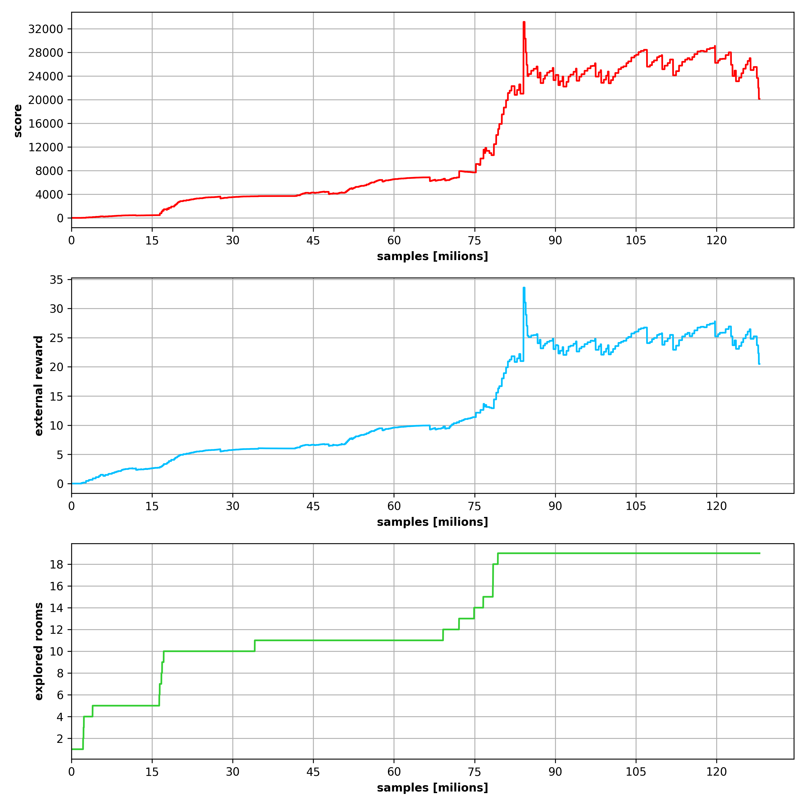
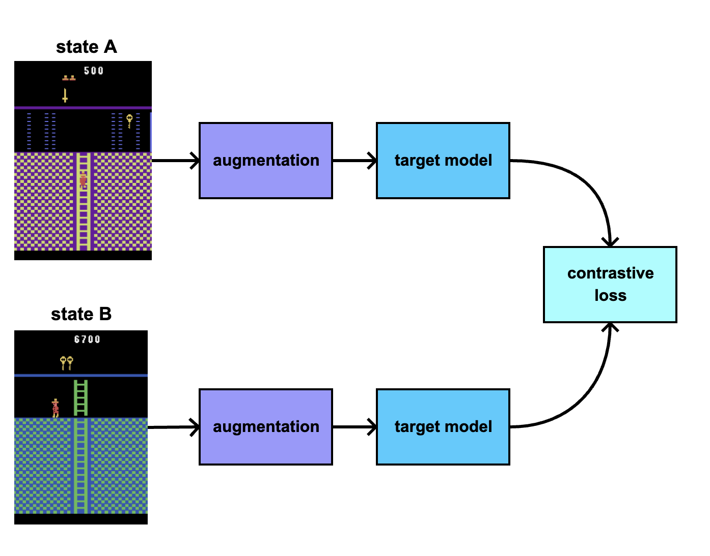
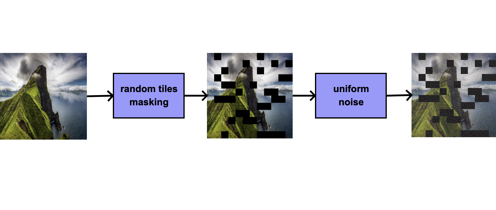
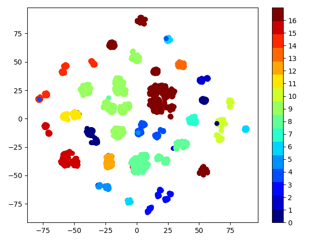
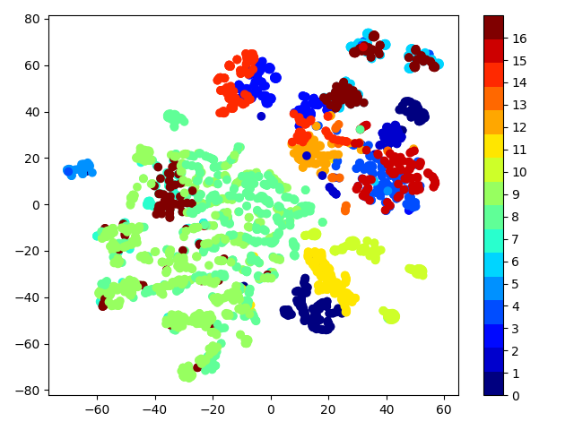
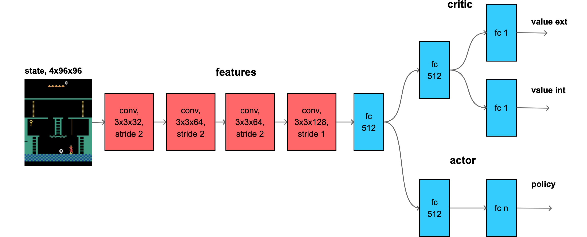
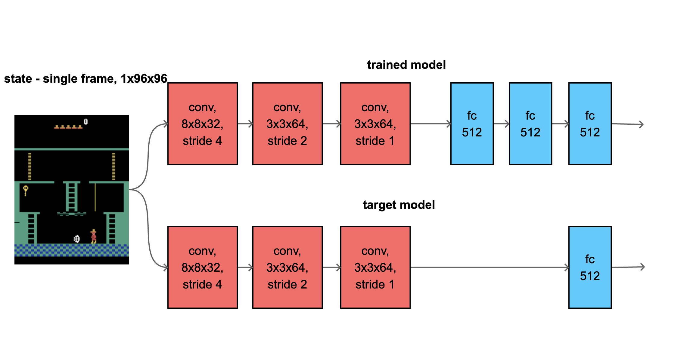

# exploration by self-supervised exploitation

**it can achieves 24 000 .. 32 000 points in Montezuma Revenge, in only 128M samples**

**key features**

- reached score 24 000 .. 32 000 on Montezuma's revenge
- only 128M samples (GoExplore : 1B samples, RND : 4B samples, Never Give Up : 35B samples)
- only single GPU training (arround 4days on RTX3060)
- no demonstrations
- no pretraining
- no environment saving/loading (no checkpoints)
- no extra (domain knowledge, agent/items positions ...) information provided

 

Based on ideas from Exploration by Random Network Distillation, Burda et alli, 2018, [arxive link](https://arxiv.org/abs/1810.12894)

# mastering procgen hard exploration seeds

there are few seeds in Procgen Env which are not possible to solve
withing 200M samples using common PPO

even RND is not doing better ... 
self-supervised exploration solved this games in just 64M steps

caveflyer                      |  climber
:-------------------------: |:-------------------------:
 |  

coinrun                      |  jumper
:-------------------------: |:-------------------------:
 |  

- Procgen envs paper : 
Leveraging Procedural Generation to Benchmark Reinforcement Learning, Cobbe et alli, 2019, [arxive link](https://arxiv.org/abs/1912.01588)
- **for hard exploration seeds read section "B.1. Evaluating Exploration"**

# how it works

### 1, main idea 
**instead of distillation random target network, try to learn better features**

### 2, motivation is generated from distillation of target model, same as in original RND paper
 

### 3, instead of fixed random target model, target model is learned using contrastive learning

### 4, augmentations

- tile masking, with 50% probability, 10% of area is masked by tiles with random size (1, 2, 4, 8, 12, 16)
- every input is noised by uniform noise with amplitude (-0.2, 0.2)

# why it works better

lets plot features space of target model

- we projected 512D features into 2D using T-SNE
- the color represents room ID

**for random model (even with orthogonal weight init), model can distinguish different rooms well, but not capture details of rooms intself :**

**when target model is trained by self-supervision, provided features have much bigger variance, which can explain better exploration :** 

# results 

## TODO

# model architecture 

## PPO actor + critic model architecture  

- input downsampled into shape 4x96x96 (4 grayscale frames)
- 4 conv layers
- separated critic heads for internal and external values
- initialised by orthogonal init
- ReLU activation

## distilled models 

- input downsampled into shape 1x96x96 (1 grayscale frames)
- normalised by running mean and std
- 3 conv layers
- initialised by orthogonal init
- ELU activation

