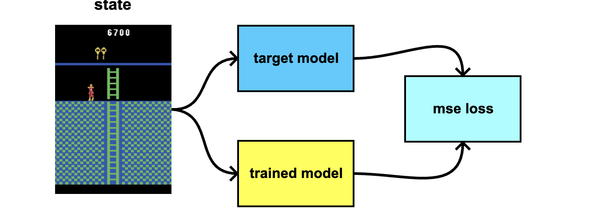

# exploration by self-supervised exploitation

**it can achieves 24 000 .. 32 000 points in Montezuma Revenge, in only 128M samples**

**key features**

- reached score 24 000 .. 32 000 on Montezuma's revenge
- only 128M samples (GoExplore : 1B samples, RND : 4B samples, Never Give Up : 35B samples)
- only single GPU training (arround 4days on RTX3060)
- no demonstrations
- no pretraining
- no environment saving/loading (no checkpoints)
- no extra (domain knowledge, agent/items positions ...) information provided

 

Based on ideas from Exploration by Random Network Distillation, Burda et alli, 2018, [arxive link](https://arxiv.org/abs/1810.12894)

### 1, main idea 
**instead of distillation random target network, try to learn better features**

### 2, motivation is generated from distillation of target model, same as in original RND paper
 

### 3, instead of fixed random target model, target model is learned using contrastive learning

### 4, augmentations

- tile masking, with 50% probability, 10% of area is masked by tiles with random size (1, 2, 4, 8, 12, 16)
- every input is noised by uniform noise with amplitude (-0.2, 0.2)

# results 

## TODO

# model architecture 

## PPO actor + critic model architecture  

- input downsampled into shape 4x96x96 (4 grayscale frames)
- 4 conv layers
- separated critic heads for internal and external values
- initialised by orthogonal init
- ReLU activation

## distilled models 

- input downsampled into shape 1x96x96 (1 grayscale frames)
- normalised by running mean and std
- 3 conv layers
- initialised by orthogonal init
- ELU activation

